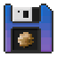
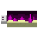
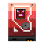

# nomi-data-reskin
Retexture of a few data in [Nomifactory CEu edition](https://github.com/Nomi-CEu/Nomi-CEu)

In the game, my understanding of these data are that these are "data sets", as apposed to "data models" in DML/DME. I want to add a medium for those data to make them look more like an item.
It's my first time making resourcepack, or any pixel art, really. Feel free to use and/or contribute.

## Previews

> Do note that GIF previews can show some flickering that's not in the game. This is probably due to quality loss during the conversion.

**Impossible realm data**: Possibly the easiest data to obtain, therefore a floppy shows how basic it is.
 

**Stellar creation data**: It's the first data an HM player will get, therefore a floppy shows how basic it is.
 

**Dragon lair data**: From T4.5 MM, it has larger data capacity than before, I'll use a USB stick
 

**Wither realm data**: Also from T4.5 MM, USB stick it is
 

**Lair of The Chaos Guardian**: Late game stuff, HDD is one of the most compact mass storage we can easily obtain.
 

**Universe Creation Data**: End game stuff, probably needs larger storage option but I'm out of ideas
 

## Credits

Original idea from [Nomi Labs](https://github.com/Nomi-CEu/Nomi-Labs), and textures by [IntegerLimit](https://github.com/IntegerLimit)

Some of the color palettes from [Color Magic](https://colormagic.app/), NO AI is involved.

## License

Shield: [![CC BY-NC 4.0][cc-by-nc-shield]][cc-by-nc]

This work is licensed under a
[Creative Commons Attribution-NonCommercial 4.0 International License][cc-by-nc].

[![CC BY-NC 4.0][cc-by-nc-image]][cc-by-nc]

[cc-by-nc]: https://creativecommons.org/licenses/by-nc/4.0/
[cc-by-nc-image]: https://licensebuttons.net/l/by-nc/4.0/88x31.png
[cc-by-nc-shield]: https://img.shields.io/badge/License-CC%20BY--NC%204.0-lightgrey.svg
